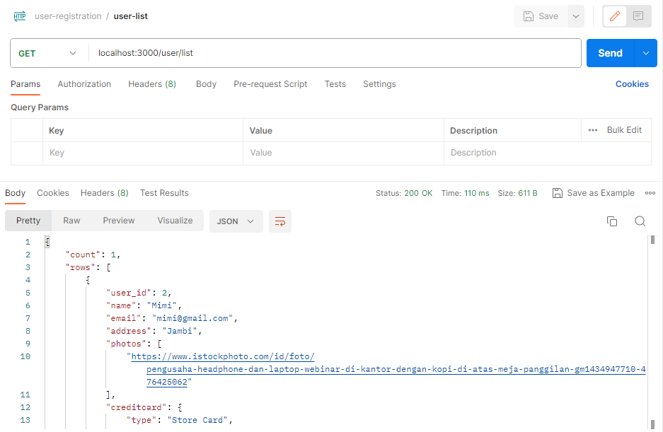

# Simple User Registration API using Node Express with PostgreSQL
Build simple API using Express server with PostgreSQL and Node.js.

# Requirements
* [git](https://git-scm.com/downloads/ "git's Download page")
* [Node.js & npm](https://nodejs.org/en/ "Node.js's Homepage")
* [PostgreSQL](https://www.postgresql.org/download/ "PostgreSQL's Download page")

# Setup
1. clone the repository
2. cd node-express-user-registration
3. Run `npm install`
4. Add .env file (PostgreSQL configuration)
    ```
    DATABASE=postgres
    DATABASE_USER=postgres
    DATABASE_PASSWORD=password
    DATABASE_HOST=localhost
    DATABASE_PORT=5432
    ```
5. Execute [this query](./init.sql) on your local to create table
6. Run `npm start`
7. Go to http://localhost:3000

See Postman collection [here](./user-registration.postman_collection.json)

# API 

- User register


- User list


- User detail


- User update


